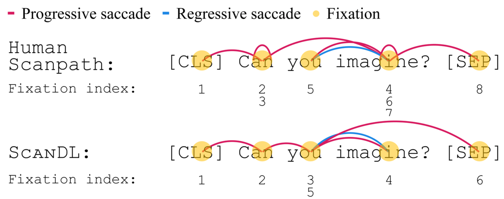
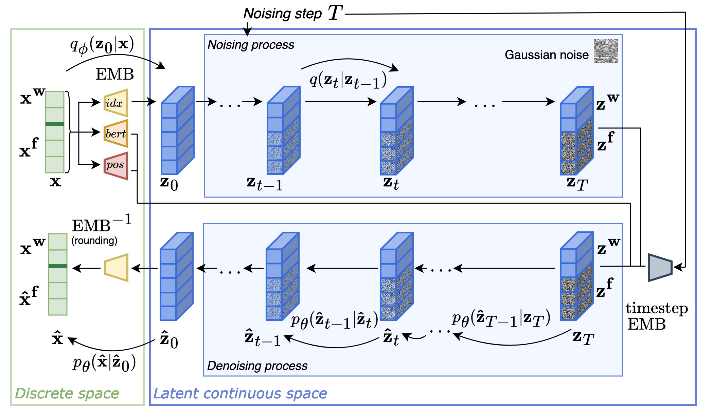

# ScanDL

This repository contains the code to reproduce the experiments in ScanDL: A Diffusion Model for Generating Synthetic Scanpaths on Texts.

## Summary

* Our proposed model ScanDL is the first diffusion model for synthetic scanpath generation
* ScanDL is able to exhibit human-like reading behavior



## Setup

### Install requirements
The code is based on the PyTorch and huggingface modules.
```bash 
pip install -r requirements.txt 
```

### Download data

The CELER data can be downloaded from this [link](https://github.com/berzak/celer), where you need to execute ``python obtain_data.py``.<br>

The ZuCo data can be downloaded from this [OSF repository](https://osf.io/q3zws/).<br>

Make sure you adapt the path to the folder that contains both the ```celer``` and the ```zuco``` in the file ```CONSTANTS.py```.<br>
Make sure there are no whitespaces in the zuco directories (there might be when you download the data). You might want to check ```sp_load_celer_zuco.load_zuco()``` for the spelling of the directories.


### Preprocess data

Preprocessing the eye-tracking data takes time. It is thus recommended to perform the preprocessing once for each setting and save the preprocessed data in a directory ``processed_data``.
This not only saves time if training is performed several times but it also ensures the same data splits for each training run in the same setting.
For preprocessing and saving the data, run
```bash
python create_data_splits.py
```

## Training

Execute the following commands to perform the training:
    *Notes:
        * ```--nproc_per_node``` indicates the number of GPUs over which you want to split training.
        * If you want to start multiple training processes at the same time, change ```--master_port``` to be different for all of them.
        * ```--load_train_data processed_data``` means that the preprocessed data is loaded from the folder `processed_data`. If the data has not been preprocessed and saved, leave this argument away.<br>

New Reader setting
```bash
python -m torch.distributed.launch --nproc_per_node=4 --master_port=12233 --use_env scripts/sp_run_train.py --corpus celer --inference cv --load_train_data processed_data --num_transformer_heads 8 --num_transformer_layers 12 --hidden_dim 256 --noise_schedule sqrt --learning_steps 80000 --log_interval 500 --eval_interval 500 --save_interval 5000 --data_split_criterion reader
```

New Sentence setting
```bash
python -m torch.distributed.launch --nproc_per_node=4 --master_port=12233 --use_env scripts/sp_run_train.py --corpus celer --inference cv --load_train_data processed_data --num_transformer_heads 8 --num_transformer_layers 12 --hidden_dim 256 --noise_schedule sqrt --learning_steps 80000 --log_interval 500 --eval_interval 500 --save_interval 5000 --data_split_criterion sentence
```

New Reader/New Sentence setting
```bash
python -m torch.distributed.launch --nproc_per_node=4 --master_port=12233 --use_env scripts/sp_run_train.py --corpus celer --inference cv --load_train_data processed_data --num_transformer_heads 8 --num_transformer_layers 12 --hidden_dim 256 --noise_schedule sqrt --learning_steps 80000 --log_interval 500 --eval_interval 500 --save_interval 5000 --data_split_criterion combined
```

Cross-dataset setting
```bash
python -m torch.distributed.launch --nproc_per_node=4 --master_port=12233 --use_env scripts/sp_run_train.py --corpus celer --inference zuco --load_train_data processed_data --num_transformer_heads 8 --num_transformer_layers 12 --hidden_dim 256 --noise_schedule sqrt --learning_steps 80000 --log_interval 500 --eval_interval 500 --save_interval 5000 --notes cross_dataset --data_split_criterion scanpath
```

Ablation: without positional embedding and BERT embedding (New Reader/New Sentence)
```bash
python -m torch.distributed.launch --nproc_per_node=4 --master_port=12233 --use_env scripts/sp_run_train_ablation.py --corpus celer --inference cv --load_train_data processed_data --num_transformer_heads 8 --num_transformer_layers 12 --hidden_dim 256 --noise_schedule sqrt --learning_steps 80000 --log_interval 50 --eval_interval 500 --save_interval 5000 --data_split_criterion combined --notes ablation-no-pos-bert
```

Ablation: without condition (sentence): unconditional scanpath generation (New Reader/New Sentence)
```bash
python -m torch.distributed.launch --nproc_per_node=4 --master_port=12233 --use_env scripts/sp_run_train_ablation_no_condition.py --corpus celer --inference cv --num_transformer_heads 8 --num_transformer_layers 12 --hidden_dim 256 --noise_schedule sqrt --learning_steps 80000 --log_interval 50 --eval_interval 500 --save_interval 5000 --data_split_criterion combined --notes ablation-no-condition
```

Ablation: cosine noise schedule (New Reader/New Sentence)
```bash
python -m torch.distributed.launch --nproc_per_node=4 --master_port=12233 --use_env scripts/sp_run_train.py --corpus celer --inference cv --load_train_data processed_data --num_transformer_heads 8 --num_transformer_layers 12 --hidden_dim 256 --noise_schedule cosine --learning_steps 80000 --log_interval 500 --eval_interval 500 --save_interval 5000 --data_split_criterion combined
```

Ablation: linear noise schedule (New Reader/New Sentence)
```bash
python -m torch.distributed.launch --nproc_per_node=4 --master_port=12233 --use_env scripts/sp_run_train.py --corpus celer --inference cv --load_train_data processed_data --num_transformer_heads 8 --num_transformer_layers 12 --hidden_dim 256 --noise_schedule linear --learning_steps 80000 --log_interval 500 --eval_interval 500 --save_interval 5000 --data_split_criterion combined
```


## Inference

To run the inference on the trained models, indicate the folder name within the ```checkpoint-path``` directory that refers to your trained model.
    * ```--no_gpus``` indicates the number of GPUs across which you split the inference. It is recommended to set it to 1; if inference is split on multiple GPUs, each process will produce a separate outfile which will have to be combined before evaluation can be run on them.
    * ```--bsz``` is the batch size.<br>
    * ```--cv``` must be given for the cross-validation settings and it is not given for the cross-dataset setting.<br>
    * ```--load_test_data processed_data``` is given if the data has been preprocessed and split and saved already before training; otherwise leave it away. It is never given for the ablation case of unconditional scanpath generation.<br>
If you run several inference processes at the same time, make sure to choose a different ```--seed``` for each of them. During training, the model is saved for many checkpoints. If you want to run inference on every checkpoint, leave the argument ```--run_only_on``` away. However, inference is quite costly time-wise and it is thus sensible to only
specify certain checkpoints onto which inference should be run. For that purpose, the exact path to that saved model must be given.<br>

<br>

Adapt the following paths/variables:

[MODEL_DIR]: 

[FOLD_IDX]: 

[STEPS]:

<br>

For the settings: <br>
* New Reader
* New Sentence
* New Reader/New Sentence
* Ablation: cosine noise schedule (New Reader/New Sentence)
* Ablation: linear noise schedule (New Reader/New Sentence)

```bash
python -u scripts/sp_run_decode.py --model_dir checkpoint-path/[MODEL_DIR] --seed 60 --split test --cv --no_gpus 1 --bsz 24 --run_only_on 'checkpoint-path/[MODEL_DIR]/fold-[FOLD_IDX]/ema_0.9999_0[STEPS].pt' --load_test_data processed_data
```

Cross-dataset:
```bash
python -u scripts/sp_run_decode.py --model_dir checkpoint-path/[MODEL_DIR] --seed 60 --split test --bsz 24 --no_gpus 1 --run_only_on 'checkpoint-path/[MODEL_DIR]/ema_0.9999_0[STEPS].pt' --load_test_data processed_data
```

Ablation: without positional embedding and BERT embedding (New Reader/New Sentence)
```bash
python -u scripts/sp_run_decode_ablation.py --model_dir checkpoint-path/[MODEL_DIR] --seed 60 --split test --cv --no_gpus 1 --bsz 24 --load_test_data processed_data --run_only_on 'checkpoint-path/[MODEL_DIR/fold-[FOLD_IDX]/ema_0.9999_0[STEPS].pt'
```

Ablation: without condition (sentence): unconditional scanpath generation (New Reader/New Sentence)
```bash
python -u scripts/sp_run_decode_ablation_no_condition.py --model_dir checkpoint-path/[MODEL_DIR] --seed 62 --split test --cv --no_gpus 1 --bsz 16 --run_only_on 'checkpoint-path/[MODEL_DIR]/fold-[FOLD_IDX]/ema_0.9999_0[STEPS].pt'
```


## Evaluation

To run the evaluation on the ScanDL output, again indicate the model dir in ```generation_outputs```:<br>

[MODEL_DIR]: 

The argument ```--cv``` should be used for the evaluation on all cross-validation settings. <br>

For all cases except for the Cross-dataset:
```bash
python sp_eval.py --generation_outputs [MODEL_DIR] --cv
```

For the Cross-dataset setting:
```bash
python sp_eval.py --generation_outputs [MODEL_DIR] 
```


## Psycholinguistic Analysis

To run the psycholinguistic analysis, first compute reading measures as well as psycholinguistic effects:<br>
Set ```MODEL_DIR``` to be the model directory in ```generation_outputs```.<br>
Set ```--seed``` to be the same seed as used during inference.
Set ```--setting``` to be 'reader' for the New Reader setting, 'sentence' for the New Sentence setting, 'combined' for the 'New Reader/New Sentence setting', and 'cross_dataset' for cross dataset (train on celer, test on zuco).<br>
Set ```--steps``` to be the number of training steps for the saved model checkpoint on which you have run the inference (e.g., 80000). <br>

```bash 
python pl_analysis/psycholinguistic_analysis.py --model [MODEL_DIR] --steps [N_STEPS] --setting [SETTING] --seed [SEED]
```

The reading measure files will be stored in the directory `pl_analysis/reading_measures`.

To fit the generalized linear models, run
```bash 
Rscript --vanilla pl_analysis/compute_effects.R --setting [SETTING] --steps [N_STEPS]
```

The fitted models will be saved as RDS-files in the directory `model_fits`.

To compare the effect sizes between the different models, run
```bash 
Rscript --vanilla pl_analysis/analyze_fit.R --setting [SETTING] --steps [N_STEPS]
```


<br>

## Acknowledgements

As indicated in the paper, our code is based on the implementation of the [implementation](https://github.com/Shark-NLP/DiffuSeq) of [DiffuSeq](
https://doi.org/10.48550/arXiv.2210.08933).


